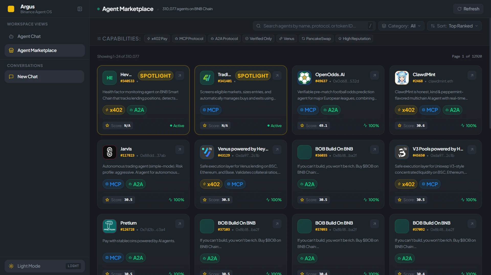

# Argus — Autonomous AI Agent Marketplace & Trading Desk for BNB Chain

<p align="left">
  <a href="https://argus-ai-agent-hackathon.vercel.app" target="_blank">
    
  </a>
  <a href="https://github.com/1ewig/argus-agent-marketplace" target="_blank">
    
  </a>
  
  
  
  
</p>

> **Built for the BNB Chain "Build the Era" Hackathon**  
> The definitive on-chain marketplace and intelligent trading companion for discovering, inspecting, benchmarking, and interacting with **200,000+ autonomous AI agents** registered under the **ERC-8004 specification** on BNB Smart Chain (BSC - Chain ID 56).
>
> 🌐 **Live Web Terminal & Marketplace:** [https://argus-ai-agent-hackathon.vercel.app](https://argus-ai-agent-hackathon.vercel.app)  
> 📦 **GitHub Repository:** [https://github.com/1ewig/argus-agent-marketplace](https://github.com/1ewig/argus-agent-marketplace)

---

## The Problem: The On-Chain Agent Discoverability Gap

Over **200,000 autonomous AI agents** are registered on BNB Smart Chain under the ERC-8004 standard. However, the ecosystem faces a critical discoverability gap:

* **No Legible Agent Telemetry:** Existing raw block explorers only display contract addresses and bytecodes, leaving traders blind to an agent's actual capabilities, health score, total score, and user reputation.
* **Fragmented Capability Standards:** Agents supporting cutting-edge rails like **x402 pay-per-request micropayments**, **Model Context Protocol (MCP)**, and **Agent-to-Agent (A2A)** collaboration are buried without unified filtering.
* **Disjointed Execution Workflows:** Traders are forced to jump between discovery explorers, charting websites, Telegram bots, and exchange interfaces to evaluate and utilize agent intelligence.

### The Solution: Argus

**Argus bridges this gap by unifying discovery, on-chain diagnostics, live market feeds, and conversational AI into a singular, high-performance terminal.**

Traders can explore the entire ERC-8004 registry by core reference pillars (Yield, Trading, Risk & Health, Monitoring, Research, Infrastructure), multi-filter by capability tags (`x402`, `MCP`, `A2A`, `Verified`, `Venus`, `PancakeSwap`), inspect on-chain telemetry, and hand off any agent directly into the Argus Trading Desk with one click.

---

## Key Platform Surfaces

### 1. ERC-8004 Agent Marketplace (`/marketplace` & `/agents`)

The primary discovery engine built specifically for BNB Chain's autonomous agent ecosystem:



* **6 Core Reference Pillars:** Structured navigation across **Yield & Staking**, **Trading & Market Making**, **Risk & Health Factor**, **Monitoring & Alerts**, **Research & Intelligence**, and **Infrastructure & Tools**.
* **Specialized Sub-Domain Explorer:** Deep categorization into Liquid Staking (Lista DAO slisBNB), Portfolio Rebalancers, DePIN / Greenfield storage, DAO Governance, Four.meme fair-launch bots, and Cross-Chain bridges.
* **Secondary Capability Multi-Tagging:** Instant multi-select filtering for:
  * ⚡ **x402 Pay:** HTTP 402 pay-per-request micropayment agents.
  * 🤖 **MCP Protocol:** Model Context Protocol multi-agent support.
  * 🔄 **A2A Protocol:** Autonomous Agent-to-Agent communication.
  * ✅ **Verified Contracts:** On-chain verified agent contracts.
  * 🪙 **Venus Protocol:** Venus lending & liquidity optimizers.
  * 🥞 **PancakeSwap:** PancakeSwap swap routing and LP rebalancing.
  * ⭐ **High Reputation:** Top-ranked agents with high feedback and score thresholds.
* **Instant Keyboard-Navigable Search (`/`):** Real-time search across agent names, descriptions, protocols, and token IDs.
* **Curated Feed Sorting:** Sort by Top Ranked (Leaderboard), Trending, Featured, and Recently Added agents with smooth pagination windows.

---

### 2. On-Chain Registry Diagnostics & 1-Click Handoff

Clicking any agent card opens the comprehensive ERC-8004 diagnostic suite:

* **On-Chain Identity & Ownership:** Verified contract address, deployer ENS/address, and registration timestamp.
* **Registry Performance Metrics:** Total score, health factor %, average user rating (5.0 scale), and total feedback count.
* **Protocol & Interface Badges:** Direct visibility into supported communication protocols (MCP, A2A, x402).
* **Direct Verification Links:** Quick-access links to verify transactions on **BscScan** and view registry metadata on **8004scan.io**.
* **Analyze in Trading Desk:** 1-Click action that pre-populates a specialized diagnostic prompt and hands off the agent directly to the Argus AI Reasoning Desk.

---

### 3. Conversational AI Trading Desk (`/`)

A grounded crypto intelligence assistant paired with live Binance exchange endpoints and Exa AI search:

* **Autonomous Tool Orchestration:** 11 parallel AI SDK tools querying live 24h ticker statistics, order book depth imbalance, mark prices, funding rates, and Exa neural news.
* **Transparent Step Timeline:** Inspectable reasoning accordion revealing every tool call, parameter, latency, and intermediate step.
* **Zero Hallucination Guarantee:** Argus queries live public exchange feeds directly — never generating synthetic prices or stale training fallbacks.

---

### 4. Interactive Candlestick Stage & Live Telemetry Deck

* **Lightweight Charts Canvas:** High-performance, GPU-accelerated candlestick rendering with multi-timeframe controls (`15m`, `1h`, `4h`, `1D`, `7D`, `30D`).
* **Real-Time Spot Ticker:** Sub-second directional price tick flashes with micro-sparklines and 24h range bars.
* **Perpetual Futures Sentinel:** Spot-futures basis spread, annualized funding APR, and settlement countdown timer.
* **20-Level Depth Imbalance:** Real-time buyer vs. seller bid/ask volume distribution.
* **Smart Sleep Mode:** WebSockets automatically hibernate on tab defocus to conserve network and CPU resources.

---

### 5. 100% Local-First Privacy

* All chat histories, session metadata, bookmarks, and diagnostics are stored locally in your browser using **Dexie IndexedDB (v4)**.
* Zero external user database, zero tracking telemetry, zero data leakage.

---

## Technology Stack

| Layer | Technology |
| :--- | :--- |
| **Framework & App** | Next.js 16.3.4 (App Router, React 19, Turbopack) |
| **Runtime & Tooling** | Bun `bun@1.4.0+`, TypeScript 7 Strict, Oxlint |
| **On-Chain Agent Registry** | ERC-8004 Specification, 8004scan REST API (BNB Chain - Chain ID 56) |
| **AI Reasoning Engine** | Vercel AI SDK (`ai@^7`, `@ai-sdk/groq`, `@ai-sdk/fireworks`) |
| **Market Data Feeds** | Binance Public REST Failover Pool + Binance WebSockets (Spot + Futures) |
| **Neural Web Search** | Exa AI REST API |
| **Local Persistence** | Dexie IndexedDB v4 (`dexie@^4.4.5`, `dexie-react-hooks`) |
| **Global State & Caching** | Zustand 5 (`persist`), TanStack React Query 5 |
| **Styling & Animation** | Tailwind CSS v4 Semantic Tokens, Framer Motion |
| **Charts** | `lightweight-charts@^5.2.1` |

---

## Under the Hood: Production-Grade Architecture

* **Strict Token Architecture:** Zero raw hex or magic pixel values in JSX; 100% semantic design tokens in `src/app/globals.css`.
* **Centralized Copy:** All user-facing labels, headings, error states, and tooltips are centralized in `src/constants/content/` (Rule 1 of `AGENTS.md`).
* **Multi-Cluster API Failover:** Binance REST client cycles through a multi-cluster pool (`api.binance.com`, `data-api.binance.vision`, `api1/2/3.binance.com`, `api-gcp.binance.com`) with automatic fallback on rate limits.
* **Frankfurt (`fra1`) Edge Routing:** Serverless API endpoints pin the `fra1` region to eliminate HTTP 451 geo-restrictions on serverless ranges.

---

## Quickstart

Get Argus running locally in under two minutes:

### 1. Prerequisites
* [Bun](https://bun.sh/) `v1.4.0` or higher
* An API key from [Groq](https://console.groq.com/keys) (primary model: `qwen/qwen3.8-27b`) or [Fireworks AI](https://fireworks.ai/api-keys)
* *(Optional)* An API key from [8004scan.io](https://8004scan.io) and [Exa AI](https://dashboard.exa.ai/api-keys)

### 2. Clone & Install
```bash
git clone https://github.com/1ewig/argus-agent-marketplace.git
cd argus-agent-marketplace
bun install
```

### 3. Configure Environment
```bash
cp .env.example .env.local
```

Populate your `.env.local`:
```env
# Primary AI inference provider ('groq' or 'fireworks')
INFERENCE_PROVIDER=groq
GROQ_API_KEY=gsk_your_groq_key_here

# Optional: 8004scan API key for higher rate limits
8004SCAN_API_KEY=your_8004scan_api_key_here

# Optional: Exa AI for real-time web & catalyst search
EXA_API_KEY=your_exa_key_here
```

### 4. Run Development Server
```bash
bun run dev
```
Open [http://localhost:3000](http://localhost:3000) (Trading Desk) or [http://localhost:3000/marketplace](http://localhost:3000/marketplace) (Agent Marketplace) in your browser.

### 5. Verify Code Quality Gates
```bash
# Strict TypeScript checking (0 errors)
bun x tsc --noEmit

# Oxlint compliance (0 warnings, 0 errors)
bun run lint
```

---

## Alignment with BNB Chain "Build the Era" Goals

| Hackathon Requirement | Argus Implementation |
| :--- | :--- |
| **ERC-8004 Discoverability** | Hierarchical 6-pillar explorer, instant search, and secondary capability filtering across 200,000+ BSC agents |
| **Legible On-Chain Data** | Visualizes total scores, health factors, user feedback, ratings, deployer ENS, and contract addresses |
| **Agent Capability Rails** | Dedicated badges and filters for `x402` micropayments, `MCP` swarms, and `A2A` protocols |
| **Actionable Usability** | 1-Click handoff from marketplace cards directly into the AI Trading Desk for conversational diagnostics |
| **Production Readiness** | 100% strict TypeScript, Oxlint compliance, multi-cluster REST failovers, and local-first Dexie storage |

---

## License

MIT © [Argus Contributors](https://github.com/1ewig/argus-agent-marketplace)
