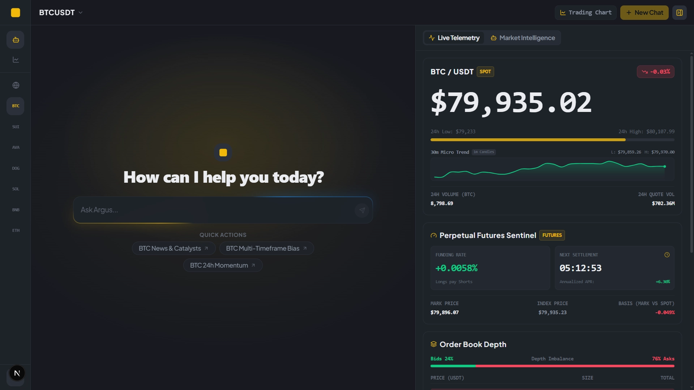
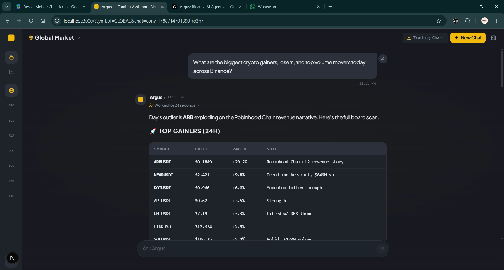
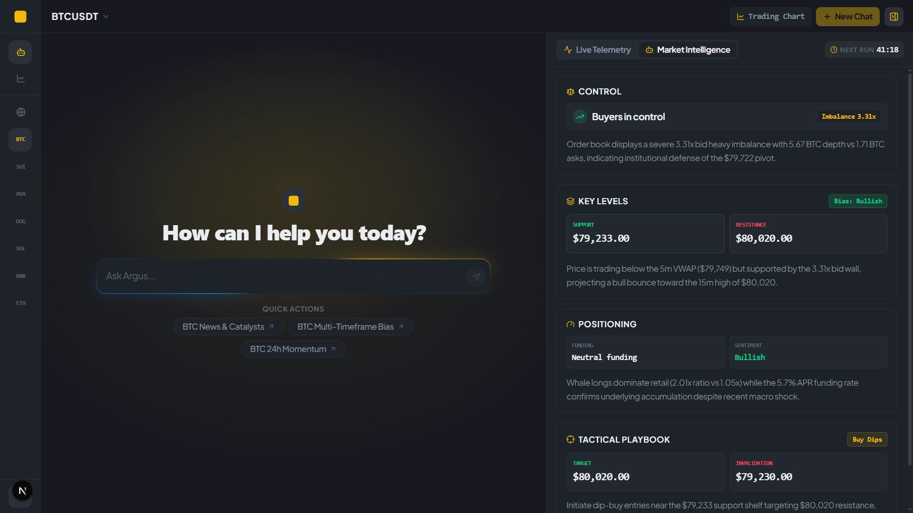
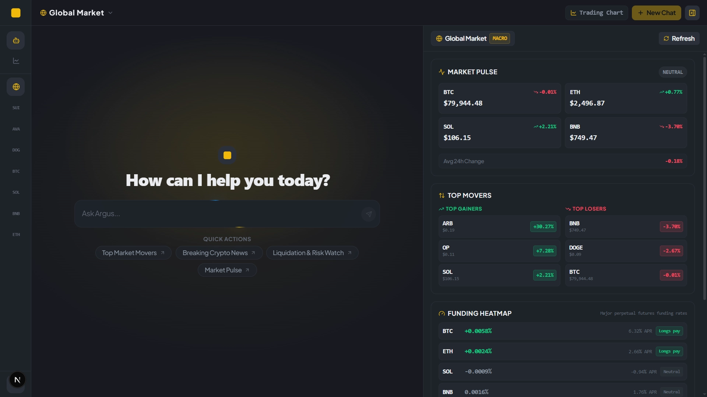
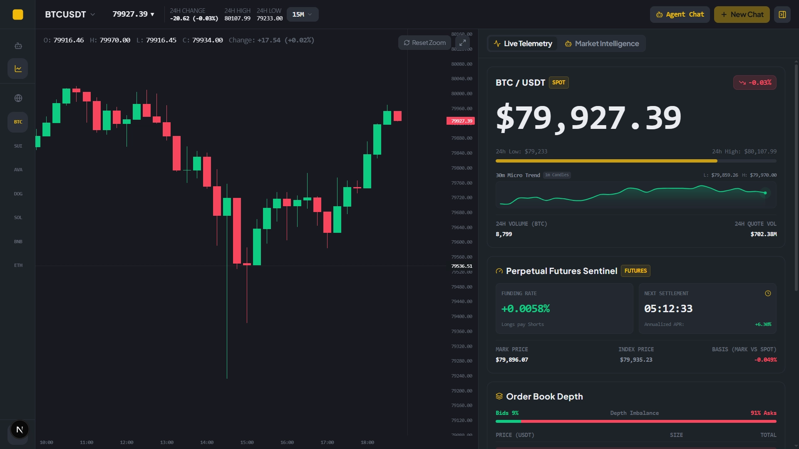
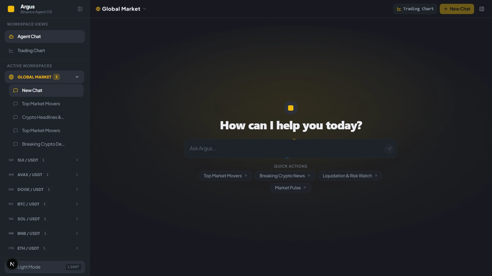

# Argus — Your Intelligent Trading Desk Companion

> A grounded, real-time crypto assistant pairing live Binance exchange streams with Exa AI neural search to bring focus and clarity to fast-moving markets.  
> Built for the **Binance Agent OS Mini Hackathon (Track A)**.



---

## The Story Behind Argus

If you've ever traded crypto during high volatility, you know the feeling of "tab overload."

You have Binance Spot open in one window, Futures funding rates in another, order book depth on a third, and Twitter or Telegram open on your phone trying to figure out why a token just spiked 8% in five minutes. By the time you piece everything together, the move has already played out.

We built **Argus** to solve this.

Think of Argus as that calm, analytical teammate sitting next to you at the desk. Instead of guessing, giving vague opinions, or summarizing stale numbers, Argus reaches directly into live Binance exchange endpoints and Exa neural search in parallel. It pulls the exact numbers that matter — spread, order book imbalance, funding APR, whale positioning, and breaking news catalysts — and breaks them down in plain, actionable English.

---

## Guided Visual Tour of the Workstation

### 1. Grounded Multi-Turn Agent Conversation (`Reasoning & Tool Execution`)

Ask complex, open-ended market questions and watch Argus orchestrate multiple live data checks in parallel:



* **Autonomous Tool Orchestration:** In the screenshot above, asking *"What are the biggest crypto gainers, losers, and top volume movers today across Binance?"* triggered parallel 24h stats checks, volume scans, and Exa neural search.
* **Inspectable Reasoning Timeline:** The collapsible `Worked for 24 seconds` accordion lets you inspect the full execution trace: tool calls, parameters, raw exchange responses, and model thinking.
* **Real Catalysts, Not Just Numbers:** Argus explains *why* assets move — highlighting that the day's biggest outlier (ARB +29.2%) was driven by the Robinhood Chain L2 revenue narrative.

---

### 2. Real-Time Telemetry Deck (`Spot + Futures WebSocket`)

Beside your conversation sits a live telemetry panel connected directly to Binance WebSockets:


* **Live Ticker:** Real-time price ticks with directional flash, 24h high/low bar, and a smoothed 30-minute micro-trend sparkline.
* **Perpetual Futures Sentinel:** Live mark price, index price, spot-futures basis, annualized APR, and an active settlement countdown timer ticking toward the next funding cycle.
* **Order Book Depth Imbalance:** 20-level visualizer showing real-time bid vs. ask distribution, spread percentage, and buyer vs. seller volume defense shelves.

---

### 3. Market Intelligence Sidecar Agent (`Autonomous 4-Card Synthesis`)

Switch the right panel tab to **Market Intelligence** to activate an autonomous background sidecar agent. It scans 9 live exchange feeds simultaneously (klines, order book, 5m VWAP, funding rates, whale vs. retail positioning, and Exa news catalysts) and outputs **four executive cards**:



1. **CONTROL:** Who owns the current auction — live bid/ask volume imbalance ratio (e.g. `3.31x bid defense`) and institutional order book walls.
2. **KEY LEVELS:** Clear quantitative support and resistance anchors, 5m VWAP pivots, and 15m range targets.
3. **POSITIONING:** Whale sentiment vs. retail account long/short skew, annualized funding rate pressure, and systemic bias.
4. **TACTICAL PLAYBOOK:** Concrete trade setups with target levels, invalidation thresholds, and risk conditions.

> **Reliability Guarantee:** The intelligence snapshot is cached locally for 1 hour with an active countdown timer. Even if LLM rate limits occur, a deterministic mathematical synthesizer derives the exact 4-card payload from raw exchange math — never synthetic or broken views.

---

### 4. Global Macro Deck (`GLOBAL` Workspace)

When you need a top-down view of market conditions before zooming into individual tokens, jump into the `GLOBAL` workspace:



* **Market Pulse:** Real-time directional bias and 24h performance across major core assets (BTC, ETH, SOL, BNB).
* **Top Movers:** Leading gainers and losers across the active Binance USDT universe.
* **Funding Heatmap:** Systemic leverage, funding rates, and annualized APR across perpetual contracts to spot crowded trades.
* **Macro Positioning:** Retail vs. whale directional positioning for BTC and ETH.
* **Instant Cache Refresh:** Dedicated cache-busting button to pull fresh snapshots on demand.

---

### 5. Interactive Candlestick Trading Chart

Argus lets you toggle smoothly between the conversational AI stage and a full-screen candlestick chart powered by Lightweight Charts, keeping your telemetry deck right beside you:



* **Direct Exchange Feeds:** Binance historical klines combined with a live WebSocket kline and ticker stream.
* **Multi-Timeframe Switcher:** Seamlessly switch intervals (`15m`, `1h`, `4h`, `1D`, `7D`, `30D`).
* **Floating Dynamic Legend:** Real-time Open, High, Low, Close, and Volume precision tracking on hover.
* **Controls:** One-click zoom reset and full-screen trading mode.

---

### 6. Multi-Symbol Workspaces & Local-First Privacy

Organize your trading workflows by currency pairs with dedicated workspace groupings and session history:



* **Symbol Grouping:** Group conversations automatically under `BTC`, `ETH`, `SOL`, `BNB`, `DOGE`, `AVAX`, `SUI`, or `GLOBAL`.
* **Zero-Flash Switching:** Prewarmed message caching allows instant 0ms switching between symbol threads.
* **100% Private & Local:** All conversations, session records, and intelligence snapshots are persisted in your browser via Dexie IndexedDB. No external database accounts or tracking scripts required.

---

## How It Works in Practice

1. **Pick a Workspace or Search Any Coin:**  
   Hit `Ctrl + K` (or `Cmd + K` on Mac) to search any active Binance USDT pair, or click any symbol group in the sidebar.
2. **Ask Natural Questions:**  
   * *"What's the 24h momentum on ETH and are buyers or sellers dominating the order book?"*
   * *"What is the funding rate on BTC perpetuals right now and what does the retail long/short ratio look like?"*
   * *"Why is BNB moving today? Search for any major news or governance announcements."*
   * *"Give me a complete tactical breakdown of SOL with key support and resistance levels."*
3. **Inspect the Process:**  
   Watch the agent's reasoning process unfold in a clean, collapsible timeline. Inspect tool arguments, live exchange results, and token metrics before reading the final takeaway.

---

## Architecture & Engineering Standards

Argus was built from the ground up with strict separation of concerns, high-performance streaming, and robust failover:

* **Bun Runtime (`bun@1.4.0+`):** Built and tested strictly with Bun for blazingly fast installs, typechecks, and execution.
* **TypeScript 7 Strict & Oxlint:** Zero `any` escapes, typed Zod schemas, and 0 warnings / 0 errors across 170 files.
* **Smooth 60Hz Streaming & Render Isolation:** Multi-step SSE streaming via Vercel AI SDK (`ai@7`) with requestAnimationFrame batching and a dedicated `ChatClient` orchestrator to prevent UI freezes or frame drops.
* **Multi-Cluster Failover Pool:** Binance REST queries rotate through a multi-cluster pool (`api.binance.com`, `data-api.binance.vision`, `api1/2/3.binance.com`, `api-gcp.binance.com`) with automated retry logic on timeouts or rate limits.
* **Frankfurt Edge Routing (`fra1`):** Serverless API functions pin the Frankfurt region (`fra1`) to prevent Binance HTTP 451 geo-restrictions on US serverless IP ranges.
* **Zero Hardcoded Design Tokens / Copy:** Semantic design tokens in `src/app/globals.css` and 100% centralized copy in `src/constants/content/`.

For an exhaustive technical deep dive, explore our documentation:  
👉 **[Read the Full Technical Project Summary (`docs/PROJECT_SUMMARY.md`)](docs/PROJECT_SUMMARY.md)**

---

## Quickstart for Reviewers

You can have Argus running locally in under two minutes:

### 1. Prerequisites
* [Bun](https://bun.sh/) `v1.4.0` or higher
* A free API key from [Groq](https://console.groq.com/keys) (primary model: `qwen/qwen3.8-27b`) or [Fireworks AI](https://fireworks.ai/api-keys)
* *(Optional)* An API key from [Exa AI](https://dashboard.exa.ai/api-keys) for live news search

### 2. Install Dependencies
```bash
git clone <repository-url>
cd argus
bun install
```

### 3. Configure Environment
Create a `.env.local` file from the example:
```bash
cp .env.example .env.local
```

Add your keys to `.env.local`:
```env
# Primary inference provider ('groq' or 'fireworks')
INFERENCE_PROVIDER=groq
GROQ_API_KEY=gsk_your_groq_key_here

# Optional: Exa AI for web & catalyst search
EXA_API_KEY=your_exa_key_here
```

### 4. Launch the Trading Desk
```bash
bun run dev
```
Open [http://localhost:3000](http://localhost:3000) in your browser.

### 5. Validate Code Quality
```bash
# Verify strict TypeScript types (0 errors)
bun x tsc --noEmit

# Verify Oxlint standards (0 warnings, 0 errors)
bun run lint
```

---

## Built for Binance Agent OS

Argus demonstrates what a practical, production-grade autonomous agent on Binance should feel like: grounded in authentic exchange feeds, respectful of trader cognitive load, visually stunning, and engineered with uncompromising performance.

Thank you to the Binance team and judges for reviewing our project!

---

## License

MIT © Argus Contributors
